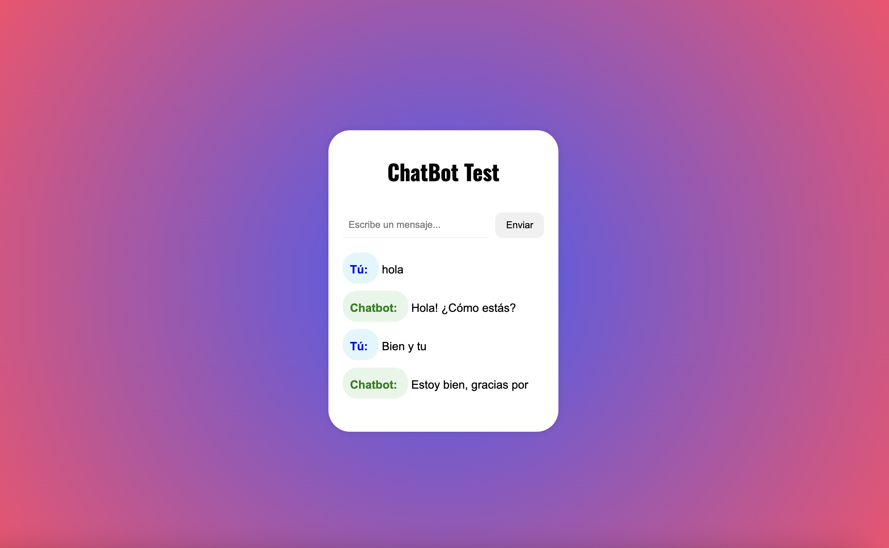

<div align="center">

# Chatbot en PHP y Javascript 

Este es un chatbot desarrollado con PHP y JavaScript que permite a los usuarios interactuar con una IA de respuesta automatizada en tiempo real.

</div>

## Captura de Pantalla
<div align = "center" >

</div>

## Características

- Comunicación en tiempo real utilizando AJAX.

- Backend en PHP para el procesamiento de mensajes.

- Frontend en JavaScript con una interfaz sencilla e interactiva.

- Registro de conversaciones en archivos o base de datos.

## Requisitos

- Servidor web con soporte para PHP (Apache, Nginx, etc.).

- PHP 7.4 o superior.
  
- Base de datos MySQL (opcional para almacenamiento de conversaciones).

- Navegador moderno con soporte para JavaScript.

## Instalación

1. Clona el repositorio

   ```sh
   git clone https://github.com/Esterfrndz/chatbot
   ```
## Estructura del proyecto

* chatbot/
  * api/
      * chatbot.php
  * assets/
      * sounds/
          * message-sound.mp3
  * index.html
  * db.php
  * script.js
  * style.css
  * README.md
